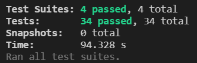
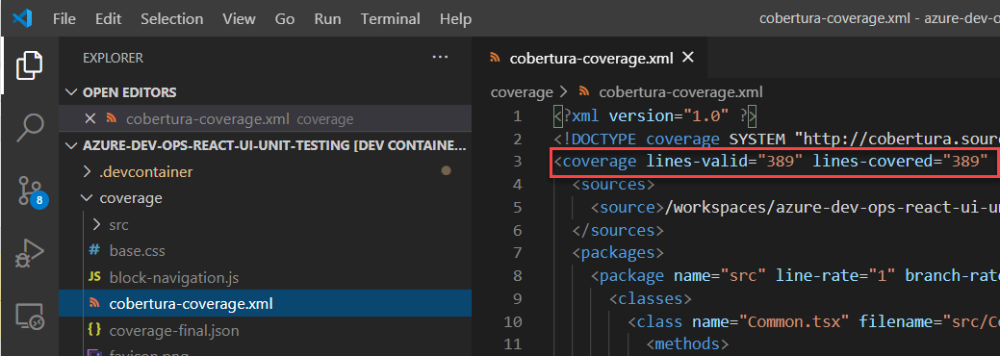
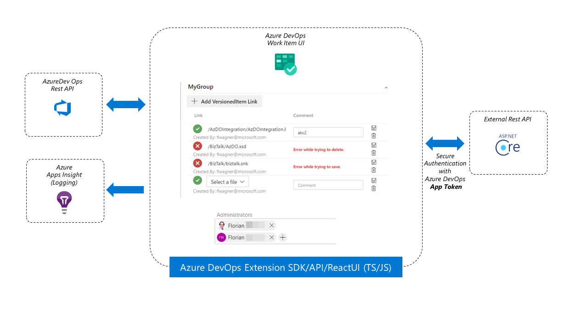

# Unit test Azure Dev Ops React UI Extensions or how to mock Azure DevOps Extension SDK and API

[](https://dev.azure.com/h2floh/Azure%20Dev%20Ops%20React%20UI%20Unit%20Testing/_build/latest?definitionId=1&branchName=main)
[](https://dev.azure.com/h2floh/Azure%20Dev%20Ops%20React%20UI%20Unit%20Testing/_build)
[](https://dev.azure.com/h2floh/Azure%20Dev%20Ops%20React%20UI%20Unit%20Testing/_build/latest?definitionId=48&branchName=main)

This repo is showcasing Azure DevOps React based UI Extension unit testing for an advanced example.

## Purpose

The focus is on how to successfully mock the JavaScript/TypeScript based Azure DevOps Extension API and SDK
and how create unit tests to get a statement coverage of 100%.
Including the use of "advanced" features like Azure DevOps event hooks and
integrating with an public Rest API endpoint external to Azure DevOps.

You can copy the [mocking implementation](src/__mocks__) and have a look into the [unit tests](src/Tests) to get ideas
on how to sucessfully mock and spy on the Azure DevOps SDK/API features your project is using.

## Try it out

0. Install Docker and VSCode for dev container environment [alternatively install node.js 14]
1. Clone this repo
2. Open the folder in the dev container
3. Install modules

    ```bash
    npm install
    ```

4. Run unit tests

    ```bash
    npm run test
    ```

5. You should see the following result

   

6. If you open now the `coverage/cobertura-coverage.xml` file you should see following result

   

Alternatively you can check out the steps in the provided pipeline [build template](pipelines/build-extension.yml).

## Explaining the advanced example

The Azure DevOps Extension package contains two Work Item Form Control components.

The _VersionedItemLink component_ can link versioned items (files) from a destinct Azure Git repo branch
(configurable in component options) to the work item.
In order to do so it will save the state via a Rest API external to Azure DevOps Services.

The _MultiIdentityPicker component_ let's you select multiple identites from the Azure DevOps Organisation associate
AAD Tenant and saves the information into a text field of the work item.

Main difference between both components is that one will save the state externally
the other internally to Azure DevOps Services.

Both have in common that they will use the JS/TS based Azure DevOps Extension SDK and API
to communicate with Azure DevOps Service and do logging towards an Azure based Application Insights instance.



## Unit testing challenges

There are following 5 challenges for the unit test:

1. Mocking return values of the Azure DevOps Extension SDK methods
2. Trigger the Azure DevOps Extension WorkItemForm events of the control (part of SDK)
3. Mocking return values and classes of the Azure DevOps Extension API
4. Mock the external RestAPI calls and spy on the values transmitted
5. Mocking and spy on the logging methods (Application Insights SDK)

## Beyond unit testing

- We [provide](pipelines) a Azure DevOps Pipeline CI/CD yaml template which can be reused for your project
to build test and deploy extensions to a Staging and Production stage.
- We [provide](dummyrestapi) a dummy Rest API for the ValidationLink Table extension
which showcases the authentication setting to consume the AppToken

