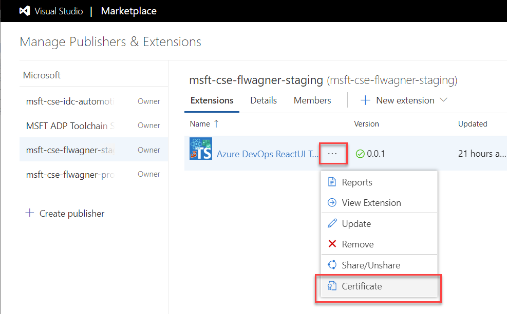

# Dummy Rest API

This API fulfills the purpose to save and retrieve the state of the _VersionedItemsTable control_.

It just implements a simple in memory list to store the items (that's why we call it dummy).

The more interesting part is the authentication respective validating the Authorization _Bearer Token_,
which will be the Extension's App Token generated by Azure DevOps.

## Build

To build the Rest API you need Docker to be installed.

```bash
dummyrestapi> docker build -t dummyrestapi .
```

## Run

To run it you need to pass the [Extensions Secret](##extension-secret) as an environment variable.
The most simple setup is to run the docker container locally and open a tunnel via
ngrok and enter the https ngrok tunnel adress as the endpoint URL in the control settings.

Run the container:

```bash
docker run -e 'extension_secret=<extension secret from portal>' -p 5001:80 dummyrestapi
```

Open the ngrok tunnel:

```bash
ngrok http 5001
```

## Extension Secret

To retrieve the extension secret you must go to the management pane of your [Visual Studio Marketplace account](https://docs.microsoft.com/en-us/azure/devops/extend/publish/overview?view=azure-devops):


